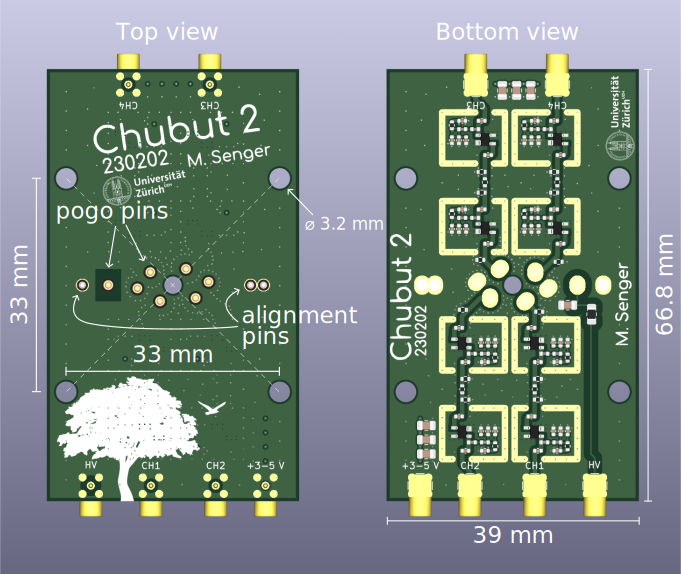
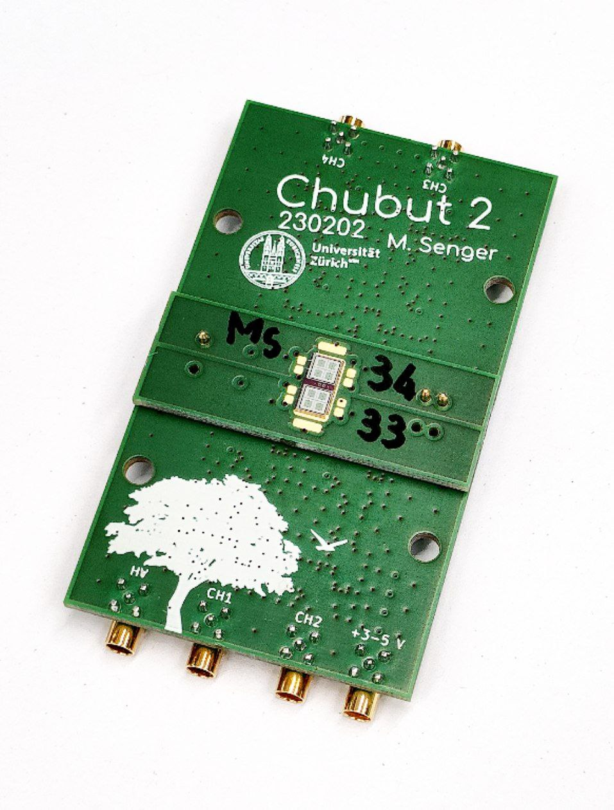

# Chubut_2

The *Chubut 2* is a 4 channel readout board designed to operate with Low Gain Avalanche Detectors (LGADs). This repository contains the board design source files.

Documentation can be found [here](https://sengerm.github.io/Chubut_2/doc/testing/index.html).

